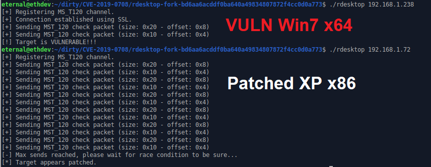

# CVE-2019-0708
Unauthenticated CVE-2019-0708 "BlueKeep" Scanner PoC by  [@JaGoTu](https://twitter.com/JaGoTu) and [@zerosum0x0](https://twitter.com/zerosum0x0).

Technical details: https://zerosum0x0.blogspot.com/2019/05/avoiding-dos-how-bluekeep-scanners-work.html

### Metasploit Module 

The Metasploit module has been pulled to rapid7:master.

`msf5> use auxiliary/scanner/rdp/cve_2019_0708_bluekeep`

https://github.com/rapid7/metasploit-framework/pull/11869

### RDPScan

If you're here for the C version of the scanner, check out ErrataRob's fork of this project which trims more fat and makes scanning a large range faster/easier.

https://github.com/robertdavidgraham/rdpscan

### In this repo

A scanner fork of rdesktop that can detect if a host is vulnerable to CVE-2019-0708 Microsoft Windows Remote Desktop Services Remote Code Execution vulnerability. It shouldn't cause denial-of-service, but there is never a 100% guarantee across all vulnerable versions of the RDP stack over the years. As it is unauthenticated, the scanner will not have reliable results for NLA hosts (which is a confirmed mitigation).



### Building and Running

There is a [pre-made rdesktop binary in the repo](https://github.com/zerosum0x0/CVE-2019-0708/blob/master/rdesktop-fork-bd6aa6acddf0ba640a49834807872f4cc0d0a773/rdesktop), but is a normal rdesktop build process:

```
git clone https://github.com/zerosum0x0/CVE-2019-0708.git
cd CVE-2019-0708/rdesktop-fork-bd6aa6acddf0ba640a49834807872f4cc0d0a773/
./bootstrap
./configure --disable-credssp --disable-smartcard
make
./rdesktop 192.168.1.7:3389
```

This fork of rdesktop is only well supported on an **X11 GUI Linux environment**. Results will vary for other platforms.
Please refer to the normal rdesktop compilation instructions or have a look at how the Docker image is built.

### Docker Instructions

You can also build from source using the Dockerfile and then run rdesktop using that image:

```
docker build . -t cve-2019-0708:latest
docker run cve-2019-0708:latest 192.168.1.7:3389
```

To scan a subnet or hosts indexed by Shodan, build the Docker image and run scan_with_docker.py:

```
./scan_with_docker.py 'asn:ASXXXX port:3389'
Not a valid subnet. Trying to use as Shodan search terms ...
Shodan search returned 498 hosts, press enter to start scan
Vulnerable hosts:
x.x.x.x
x.x.x.x
[...]

./scan_with_docker.py 192.168.1.0/24
Vulnerable hosts:
192.168.1.28
192.168.1.30
[...]
```

### Is this dangerous?

Small details of the vulnerability have already begun to reach mainstream. This tool does not grant attackers a free ride to a theoretical RCE.

Modifying this PoC to trigger the denial-of-service does lower the bar of entry but will also require some amount of effort. We did not originally offer an explanation of how this scanner works other than to tell the user it seems to be accurate in testing and follows a logical path.

System administrators need tools like this to discover vulnerable hosts. This tool is offered for legal purposes only and to forward the security community's understanding of this vulnerability. As this PoC actively exploits the vulnerability, do not use against targets without prior permission.

### Contributors

- [JaGoTu](https://twitter.com/jagotu)
- [zerosum0x0](https://twitter.com/zerosum0x0)
- [SUNET](https://github.com/SUNET)

### License

rdesktop fork is licensed as GPLv3.

Metasploit module is licensed as Apache 2.0.
